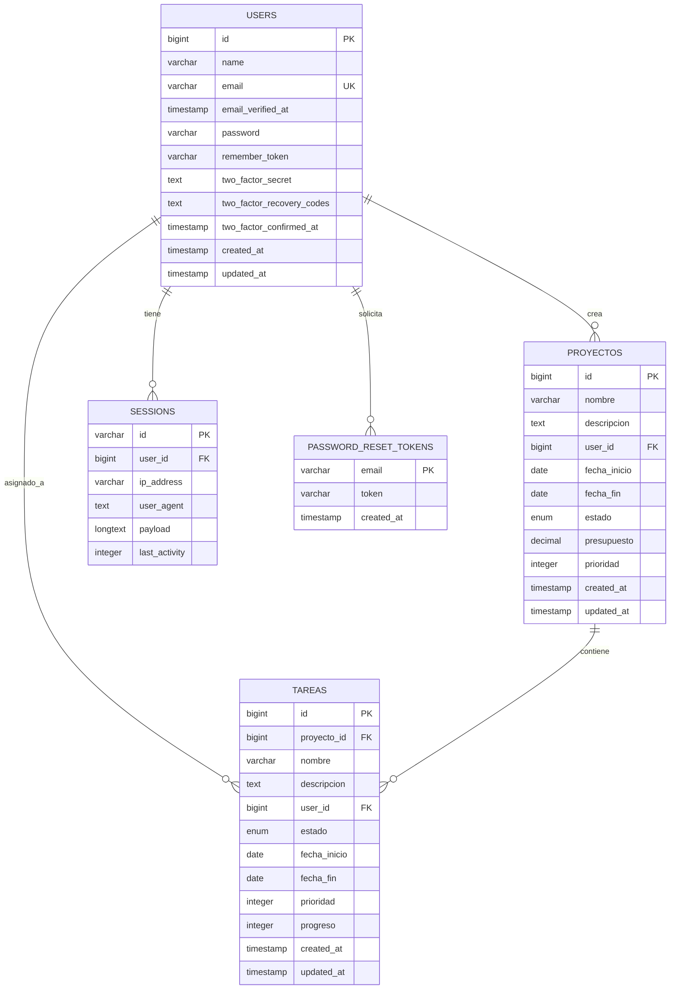
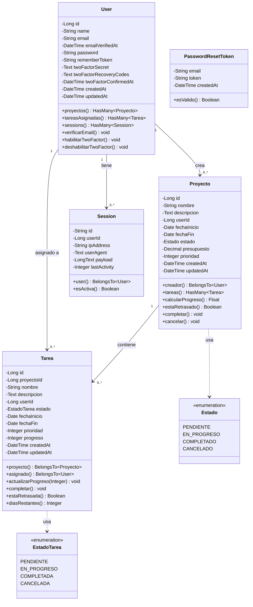
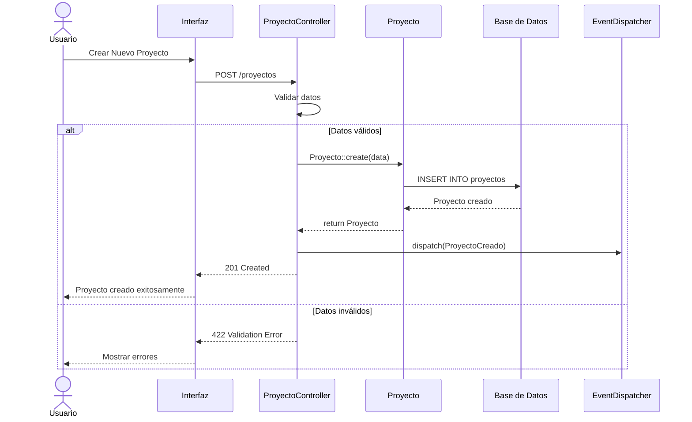
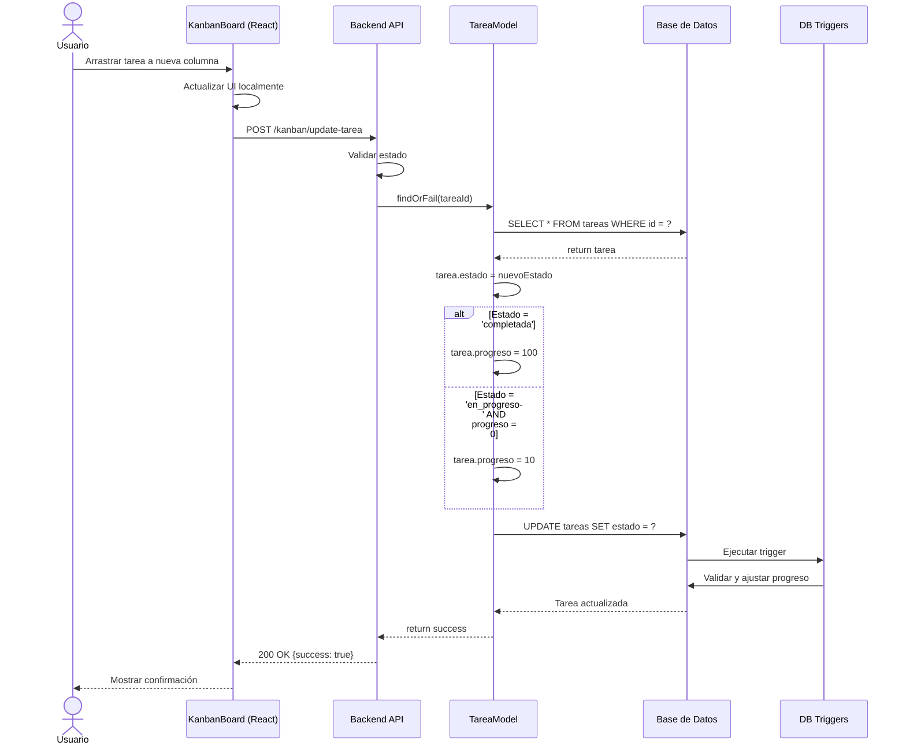
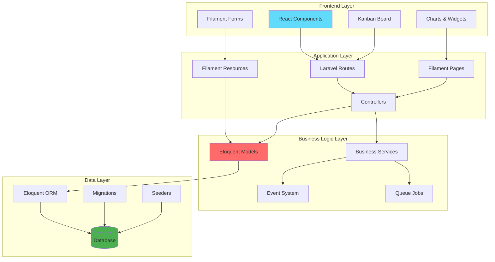
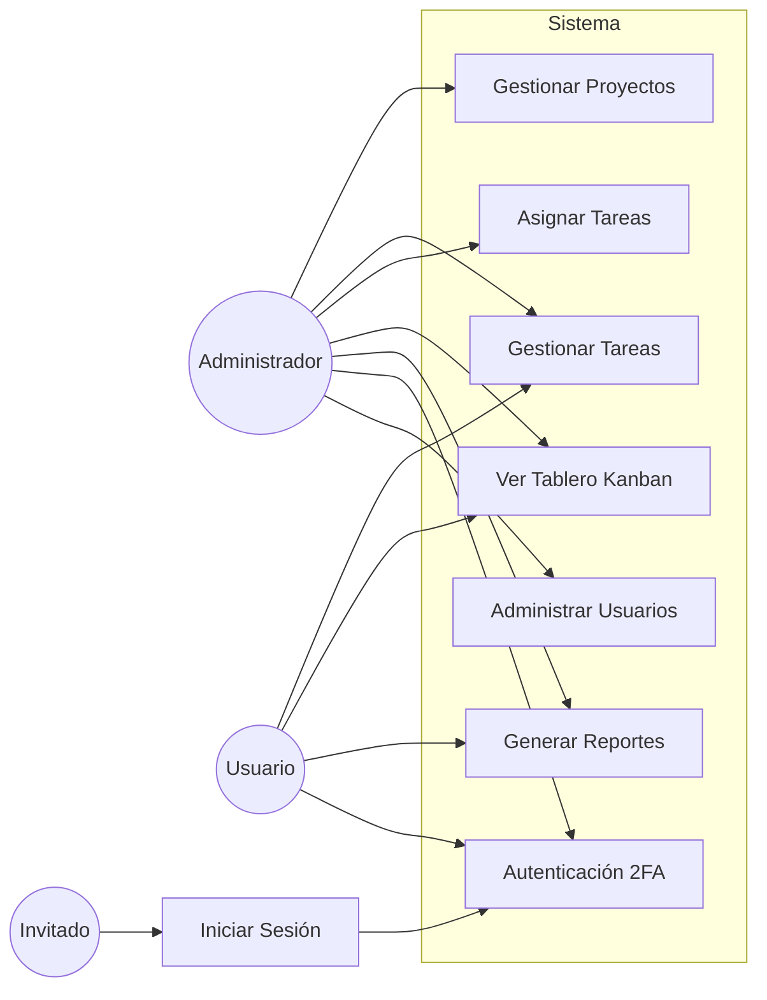
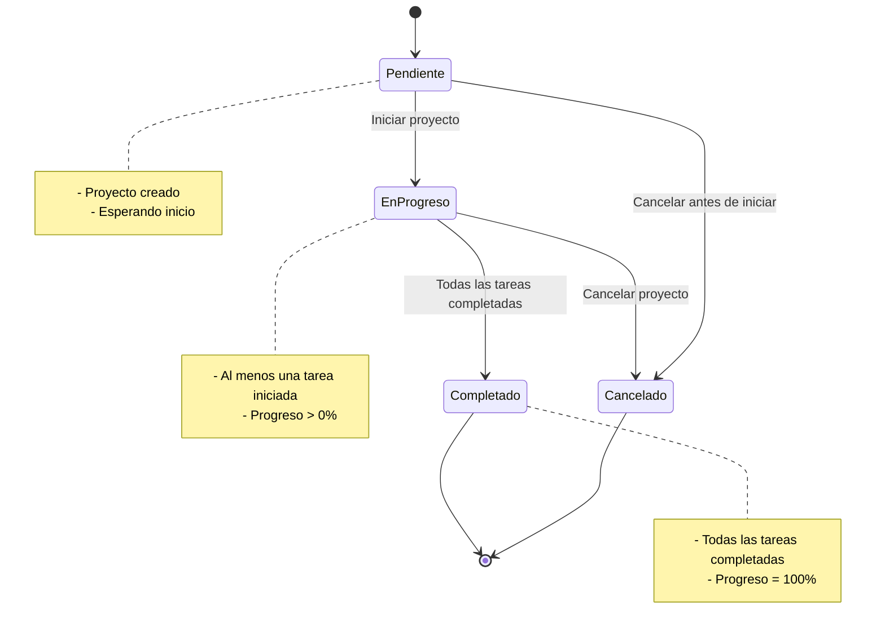
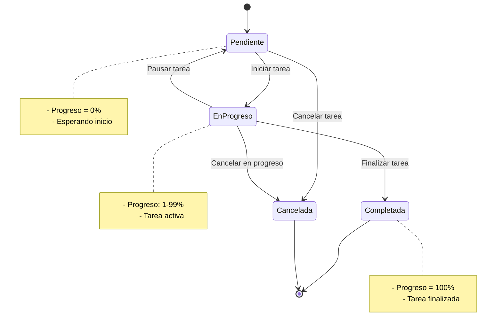

# Diagramas ER y UML - Sistema AtomInovatec

## 📊 Diagrama Entidad-Relación Completo



---

## 🏗️ Diagrama UML de Clases (Modelo de Dominio)



---

## 🔄 Diagrama de Secuencia: Crear Proyecto



---

## 🔄 Diagrama de Secuencia: Actualizar Estado de Tarea (Kanban)



---

## 📦 Diagrama de Componentes



---

## 🔐 Diagrama de Casos de Uso



---

## 🗄️ Diagrama de Despliegue

```mermaid
graph TB
    subgraph "Cliente"
        Browser[Navegador Web]
    end

    subgraph "Servidor Web"
        Nginx[Nginx/Apache]
        PHP[PHP 8.3]
        Laravel[Laravel 12]
        Vite[Vite Dev Server]
    end

    subgraph "Servicios"
        Queue[Laravel Queue]
        Cache[Redis Cache]
        Mail[Mail Service]
    end

    subgraph "Base de Datos"
        MySQL[(MySQL 8.0)]
        SQLite[(SQLite)]
    end

    Browser <--> Nginx
    Nginx <--> PHP
    PHP <--> Laravel
    Laravel <--> MySQL
    Laravel <--> SQLite
    Laravel <--> Queue
    Laravel <--> Cache
    Laravel <--> Mail
    Browser <--> Vite

    style Browser fill:#61DAFB
    style Laravel fill:#FF2D20
    style MySQL fill:#4479A1
    style SQLite fill:#003B57
```



---

## 📊 Diagrama de Estados: Proyecto



---

## 📊 Diagrama de Estados: Tarea



---

## 🔗 Diagrama de Dependencias (Relaciones entre Modelos)

```
                    ┌─────────────┐
                    │    User     │
                    └──────┬──────┘
                           │
              ┌────────────┼────────────┐
              │                         │
              ▼                         ▼
     ┌────────────────┐        ┌──────────────┐
     │   Proyecto     │        │    Tarea     │
     │                │◄───────┤              │
     │ - user_id (FK) │  1:N   │ - user_id (FK)│
     └────────────────┘        │ - proyecto_id │
                               └──────────────┘

    Relaciones:
    ═══════════
    1. User → Proyecto (1:N)
       - Un usuario crea muchos proyectos
       - Cascade on delete

    2. User → Tarea (1:N)
       - Un usuario es asignado a muchas tareas
       - Cascade on delete

    3. Proyecto → Tarea (1:N)
       - Un proyecto contiene muchas tareas
       - Cascade on delete
```

---

## 📈 Normalización de la Base de Datos

### Análisis de Formas Normales

#### ✅ Primera Forma Normal (1NF)
```
Criterios:
├── ✓ Todos los atributos son atómicos
├── ✓ No hay grupos repetitivos
├── ✓ Cada tabla tiene clave primaria
└── ✓ Orden de filas no importa

Ejemplo de 1NF en tabla TAREAS:
┌────┬─────────────┬────────────┬───────┬─────────┐
│ ID │   Nombre    │ Proyecto   │Estado │Progreso │
├────┼─────────────┼────────────┼───────┼─────────┤
│ 1  │ Diseño UI   │ 1          │ comp. │  100    │
│ 2  │ Backend API │ 1          │ prog. │   65    │
└────┴─────────────┴────────────┴───────┴─────────┘
```

#### ✅ Segunda Forma Normal (2NF)
```
Criterios:
├── ✓ Cumple 1NF
├── ✓ Todos los atributos no-clave dependen
│      completamente de la clave primaria
└── ✓ No hay dependencias parciales

Dependencias Funcionales:
TAREAS:
  id → {nombre, descripcion, proyecto_id, user_id, estado, ...}
  NO existe: {id, proyecto_id} → atributo
```

#### ✅ Tercera Forma Normal (3NF)
```
Criterios:
├── ✓ Cumple 2NF
├── ✓ No hay dependencias transitivas
└── ✓ Atributos no-clave solo dependen de PK

Ejemplo de eliminación de dependencia transitiva:
❌ ANTES (No normalizado):
TAREAS: id, nombre, proyecto_id, proyecto_nombre

✅ DESPUÉS (Normalizado):
TAREAS: id, nombre, proyecto_id
PROYECTOS: id, nombre
```

---

## 🎯 Resumen de Diseño

### Características Principales:

1. **Integridad Referencial**
   - Todas las claves foráneas definidas
   - Cascade deletes configurados
   - Constraints CHECK implementados

2. **Normalización**
   - Base de datos en 3NF
   - Sin redundancia de datos
   - Optimizada para consultas

3. **Escalabilidad**
   - Índices en columnas frecuentes
   - Vistas para consultas complejas
   - Triggers para automatización

4. **Seguridad**
   - Contraseñas hasheadas
   - Autenticación de dos factores
   - Tokens de sesión seguros

---

## 📝 Notas Técnicas

### Convenciones de Nomenclatura:
- **Tablas**: Plural, snake_case (`proyectos`, `tareas`)
- **Columnas**: snake_case (`user_id`, `fecha_inicio`)
- **Claves Primarias**: `id` (BIGINT UNSIGNED AUTO_INCREMENT)
- **Claves Foráneas**: `{tabla}_id` (`proyecto_id`, `user_id`)
- **Timestamps**: `created_at`, `updated_at`
- **Soft Deletes**: `deleted_at` (no implementado actualmente)

### Tecnologías Utilizadas:
- **ORM**: Laravel Eloquent
- **Migraciones**: Laravel Migrations
- **Motor BD**: MySQL 8.0 / SQLite 3
- **Charset**: utf8mb4_unicode_ci
- **Motor de almacenamiento**: InnoDB
